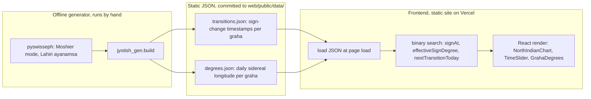
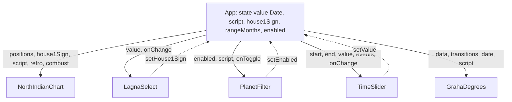
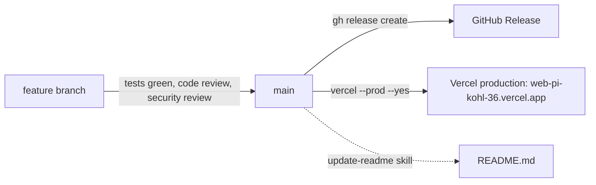

# Architecture

Three views of the same system: no backend, static JSON in, browser-only rendering out.

## 1. System architecture

No server, no DB, no astronomy at request time — the browser only ever does
lookups against data computed once, offline.

## 2. Component tree & prop flow

All derived state (`positions`, `retro`, `combust`, `events`) is computed in
`App` from `transitions.json`/`degrees.json` + `value`, then passed down —
children are presentational, no child fetches or computes astrology data itself.

## 3. Build & release pipeline

Deploys always build from `main`, never an unmerged branch (see
[`AGENTS.md`](../AGENTS.md) and the `deploy` skill). Merged branches are
deleted after landing.
